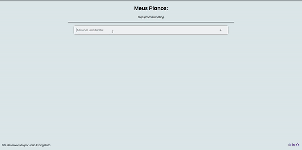

# ToDo App
<p align="center">
 📒 Organize sua rotina com o ToDo App! 🗓
</p>

O ToDo App é uma solição para lista de tarefas online de código aberto. Sua função é ajudar na organização das tarefas do cotidiano, através de uma interface simplificada e intuitiva.

## Features
- Possibilidade de adicionar um número de tarefas ilimitado
- Marcar uma tarefa como concluída 
- Apagar uma tarefa 
- Tarefas salvas localmente de maneira automática


## Preview do projeto
<div align="center">
  
</div>
<div align="center">
  <em>Link do layout: https://www.figma.com/file/3BwfRL9u2O0TKMIhBXVfMC/To-Do-List?node-id=0%3A1</em>
</div>
  
## Tecnologias utilizadas: 
  [React](https://reactjs.org/)</br>
  [TypeScript](https://www.typescriptlang.org/)</br>
  [Styled Components](https://styled-components.com/)</br>
  [Axios](https://github.com/axios/axios)</br>
  [Fontawesome](https://fontawesome.com/v5/docs/web/use-with/react)
  
## API utilizada
Para tornar o site mais dinâmico a api [Advice Slip](https://api.adviceslip.com/) foi utilizada. Dessa forma, sempre que o usuário entrar na página uma frase motivacional, séria ou cômica, sera exibida na aplicação. 

## Instalação e usabilidade
1. Com o [git](https://git-scm.com/) instalado na sua máquina, cole o seguinte comando no terminal:
```
git clone https://github.com/joaogabriels/to-do
```
2. Abra o diretório onde a pasta foi instalada e execute um dos seguintes comandos no terminal (é necessário a instalação do [NodeJS](https://nodejs.org/en/)):

Npx
```
npx init
```
Npm
```
npm init
```
Yarn
```
yarn init
```
3. Para executar a aplicação é necessário executar, dentro do diretório, um dos seguintes comandos no terminal:

Npm
```
npm start
```
Yarn
```
yarn start
```
<br>
Após esses passos a aplicação será executada através de um "localhost"

##

Criado por João Gabriel Dos Santos Evangelista 
